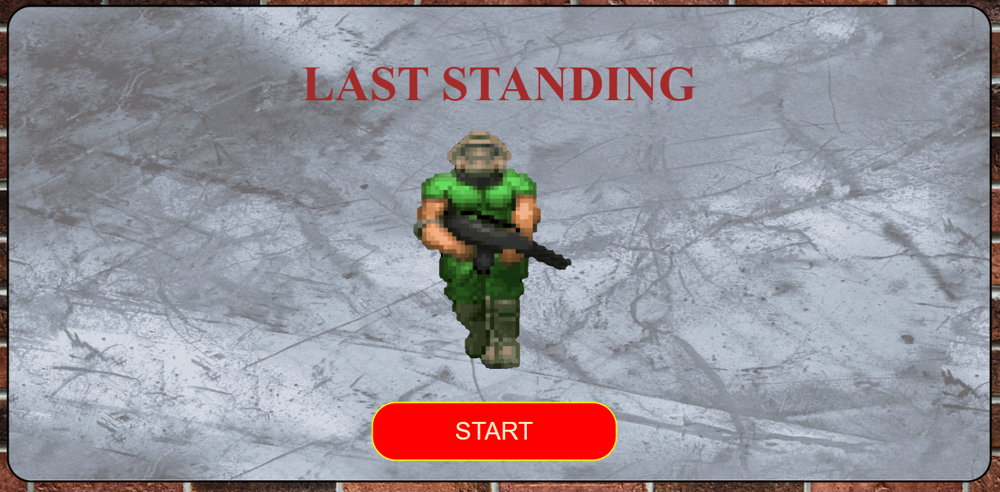
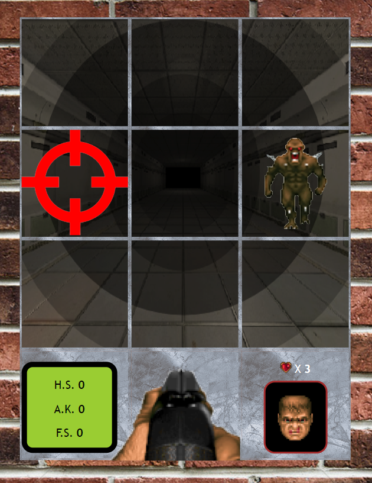
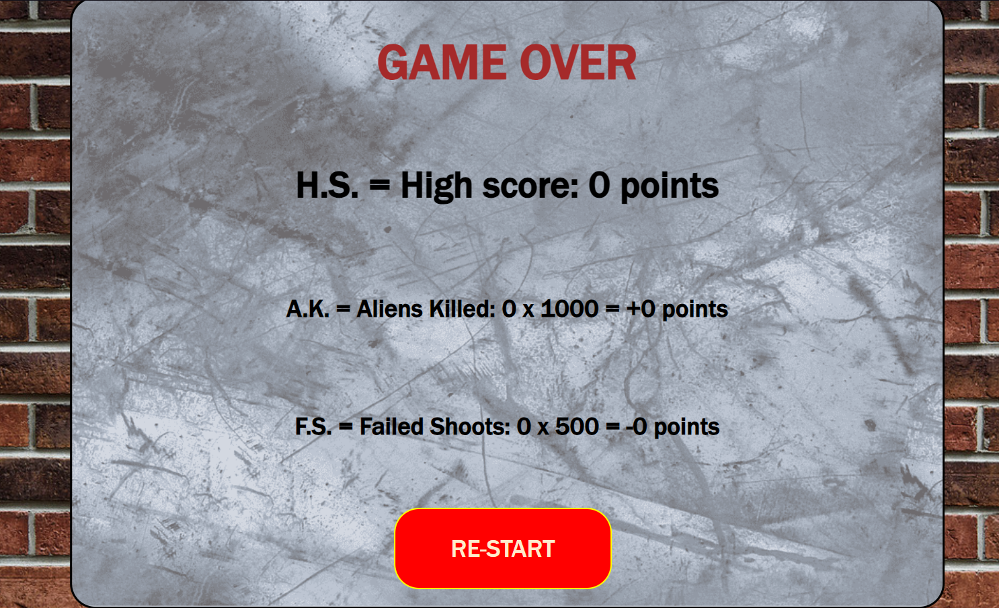
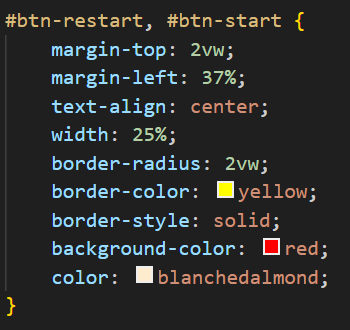
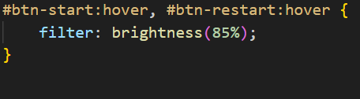
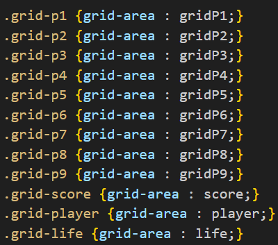
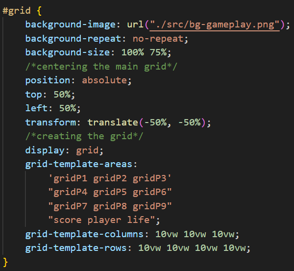
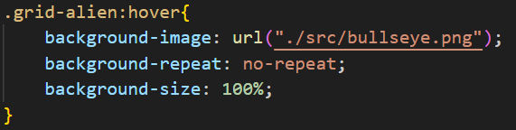
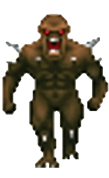

# LAST STANDING

**WARNING: First of all i want to say that the sprites and sounds are not mine, the sprites creation belong to the original creators of DOOM saga and the background images have the creators watermark on porpuse to show who create them. *(The sounds are from DOOM 1, The Legend of Zelda & som of them are free use)***

## This game is base on one of the bests FPS that ever existed, DOOM.

### You will be a militar standing in a corridor defending yourself and others from alliens using your shotgun.

#### Soo let's explain how the game will works:

* You will be standing on a position with a shotgun.
* You will need to kill the aliens by clicking on them before they attack you.
* You will make points by killing alliens.
* If you didn't kill the alien before it attacks you, you are going to lose life and don't make points.
* If you failed the shoot you will lose points.
* The game will ends when you will lose all your character life.
* You will need to play it ;) https://yagogu.github.io/last-standing/.

# Now I will go with the nerd thingies

## Document 1: index.html
### I will divide the contend of this file by 3:
1. **Head:**
    
    The head of this project only have a few importat things which are the **css file** and the **name of the game**.

2. **Body tags:**

    On here I just created *3 elements* with only one of them having more content than id:
    * **main id="startScreen":** This element is the one that have other tags inside of itself, it will be our start screen when we load the page for the first time, in her we will see a soldier walking, the title of the game and the buton to start.
    

    * **div id="grid":** This div element is where all the game will be stored *(I prefer to use a grid to divide in a better wway the space of the player)*.
    

    * **main id="scoreScreen":** The last one is for when the player dies show a gameover screen with the player stats and a button to restart the game.
    

3. **Scripts calling:** Here is the last part of the body, and where the most important thing occurs, calling the scripts. Now i'm going to explain why the order of the calls are made in an easy way. *(Later I will enter on a deep explanation of them)*: 

    * **classes.js:** This file is called first because is where I declared the classes.

    * **game.js:** On the game.js file it's where the things become tricky, here it's where we create the Game class which needs the other classes and create a loop *(by the method **.gameLoop()**)* to never ending the possibility to play the game. And where the other **main** tag and **div** of the body are modified.

    * **script.js:** I'm not going to go deep in here but this file is where are practicaly every **DOM** interaction, here are a few things that does:
        * reset stats by clicking start and restart button.
        * generate the soundtrack & the game screen.
        * mantain the alien spaw one by one and when they spawn.
        * check when & where the players click
        * check if the alien dies by the shootgun or time
        * upgrade the players life & score
        * call the *gameLoop()* method

## Document 2: style.css
### This document doesn't need a lot of explenation, here I take the id, classes and elements and give them the properties that I wanted. The most remarkables are:

* **Button hover** property where I set to decrease the brightnees of the button when the cursor it's over it.

* **Display grid** where I set new names to the grid elements to made it easier to sort on the grid.

* **Grid item hover** property where is set that shows a bullseye when the mouse it's over it to show the player where is the mouse.

## Table of resources
| resources name | resources     |
|----------------|---------------|
| alien.gif      |  |